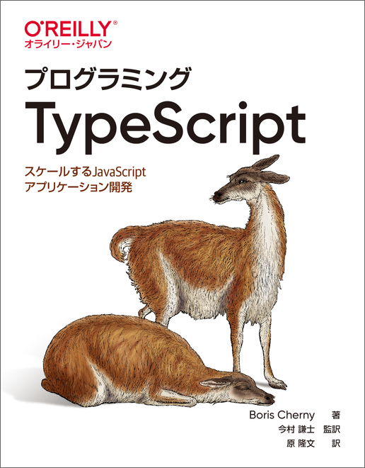
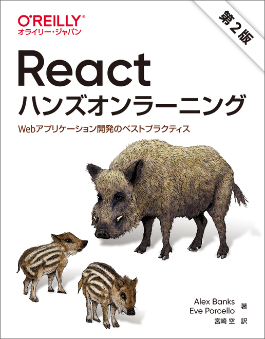

# React + Go でブログを作る
React と Go の勉強をしながら自宅サーバで公開するブログを作っていきます．

## 参考書
O'Reilly の本を参考書として利用します．

### Go の参考書
[実用 Go 言語](https://www.oreilly.co.jp/books/9784873119694/) (渋川よしき，辻大志郎，真野隼記．2022)

<div align="center"></div>

### TypeScript の参考書
[プログラミング TypeScript](https://www.oreilly.co.jp/books/9784873119045/) (Boris Cherny　著，今村謙士　監訳，原隆文　訳．2020)

<div align="center"></div>

### React の参考書
[Reactハンズオンラーニング 第2版](https://www.oreilly.co.jp/books/9784873119380/) (Alex Banks，Eve Porcello・著．宮崎空・訳．2022)

<div align="center"></div>

## 実行環境
実行環境は Docker で構築します．
次のコマンドでコンテナを立ち上げるだけです．

```bash
$ docker-compose -f (起動する YAML ファイル) up -d
```

コンテナの初回起動時には，次のコマンドを叩きます．

```bash
$ docker-compose -f (起動する YAML ファイル) pull
$ docker-compose -f (起動する YAML ファイル) build --no-cache
```
参考書のサンプルコードを実行したい場合などには，コンテナに入ってコマンドラインから実行します．

```bash
$ docker exec -it (コンテナ名) bash
```